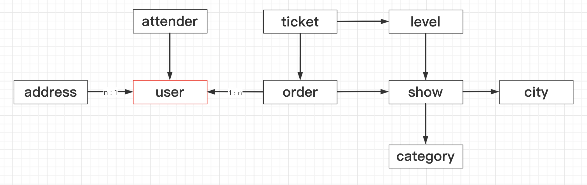

## 表设计


#### 一、表关系

| 表名称   | 说明       | one-to-many                | many-to-one   |
| -------- | ---------- | -------------------------- | ------------- |
| user     | 用户信息表 | orders/attenders/addresses |               |
| show     | 演出信息表 | levels/orders              | city/category |
| level    | 档次信息表 | tickets                    | show          |
| order    | 订单信息表 | tickets                    | user/show     |
| ticket   | 门票信息表 |                            | order/level   |
| address  | 收货地址表 |                            | user          |
| attender | 观影人信息 |                            | user          |
| city     | 城市信息表 | shows                      |               |
| category | 类别信息表 | shows                      |               |




#### 二、表字段

* user：用户信息表

| 字段名称  | 类型   | 说明            |
| --------- | ------ | --------------- |
| id        | Int    | 统编id          |
| username  | String | 账户            |
| password  | String | 密码            |
| nickname  | String | 昵称            |
| gender    | Int    | 性别(0:男,1:女) |
| birthday  | Date   | 生日            |
| identity  | String | 身份证          |
| image_url | String | 头像            |

```
| orders    | Set\<Order>    | 用户级联的所有订单     |
| attenders | Set\<Attender> | 用户级联的所有参加者   |
| addresses | Set\<Address>  | 用户级联的所有收货地址 |
```

* show：演出信息表

| 字段名称    | 类型   | 说明           |
| ----------- | ------ | -------------- |
| id          | Int    | 统编id         |
| title       | String | 标题           |
| low_price   | Int    | 最高价         |
| high_price  | Int    | 最低价         |
| start_time  | Date   | 最早时间       |
| end_time    | Date   | 最晚时间       |
| address     | String | 地址           |
| explain     | String | 说明           |
| detail      | String | 详情           |
| notice      | String | 须知           |
| image_url   | String | 演出图片       |
| city_id     | Int    | 演出从属的城市 |
| category_id | Int    | 演出从属的类别 |

```
| levels     | Set\<Level>   | 演出包含的所有档次  |
| orders     | Set\<Order>   | 演出级联的所有订单  |
```

* level：档次信息表

| 字段名称    | 类型   | 说明             |
| ----------- | ------ | ---------------- |
| id          | Int    | 统编id           |
| time        | Date   | 时间             |
| time_info   | String | 时间描述（场次） |
| price       | Int    | 价格             |
| price_info  | String | 价格描述（票档） |
| total_count | Int    | 门票总数         |
| left_count  | Int    | 门票剩余         |
| limit_count | Int    | 购票限制         |
| seat        | String | 选座情况         |
| show_id     | Int    | 档次从属的演出   |

```
| tickets     | Set\<Ticket> | 档次级联的门票   |
```

* order：订单表

| 字段名称    | 类型   | 说明                                   |
| ----------- | ------ | -------------------------------------- |
| id          | Int    | 统编id                                 |
| code        | String | 订单编号                               |
| create_time | Date   | 创建时间                               |
| status      | Int    | 订单状态                               |
| status_info | String | 状态描述（待付款, 交易成功, 交易关闭） |
| total_count | Int    | 购票数量                               |
| total_price | Int    | 总额                                   |
| linkman     | String | 联系人                                 |
| linknum     | String | 联系电话                               |
| attender    | String | 观影人                                 |
| user_id     | Int    | 订单从属的用户                         |
| show_id     | Int    | 订单从属的演出                         |

```
| tickets     | Set\<Ticket> | 订单级联的所有门票                     |
```

* ticket：门票信息表

| 字段名称  | 类型   | 说明           |
| --------- | ------ | -------------- |
| id        | Int    | 统编id         |
| price     | Int    | 门票价格       |
| seat_num  | Int    | 座位编号       |
| seat_info | String | 座位信息       |
| order_id  | Int    | 门票从属的订单 |
| grade_id  | Int    | 门票从属的档次 |

* address：收货地址表

| 字段名称 | 类型   | 说明               |
| -------- | ------ | ------------------ |
| id       | Int    | 统编id             |
| name     | String | 收件人             |
| phone    | String | 手机号             |
| detail   | String | 配送地址           |
| user_id  | Int    | 收货地址从属的用户 |

* attender：观影人信息

| 字段名称      | 类型   | 说明             |
| ------------- | ------ | ---------------- |
| id            | Int    | 统编id           |
| name          | String | 真实姓名         |
| identity_type | String | 证件类型         |
| identity_num  | String | 证件号码         |
| user_id       | Int    | 观影人从属的用户 |

* city：城市信息表

| 字段名称 | 类型       | 说明               |
| -------- | ---------- | ------------------ |
| id       | Int        | 统编id             |
| name     | String     | 城市名             |
| code     | String     | 城市编码           |

```
| shows    | Set\<Show> | 城市级联的所有演出 |
```

* category：类别信息表

| 字段名称 | 类型       | 说明               |
| -------- | ---------- | ------------------ |
| id       | Int        | 统编id             |
| name     | String     | 类别名             |
| code     | String     | 类别编码           |

```
| shows    | Set\<Show> | 类别级联的所有演出 |
```

